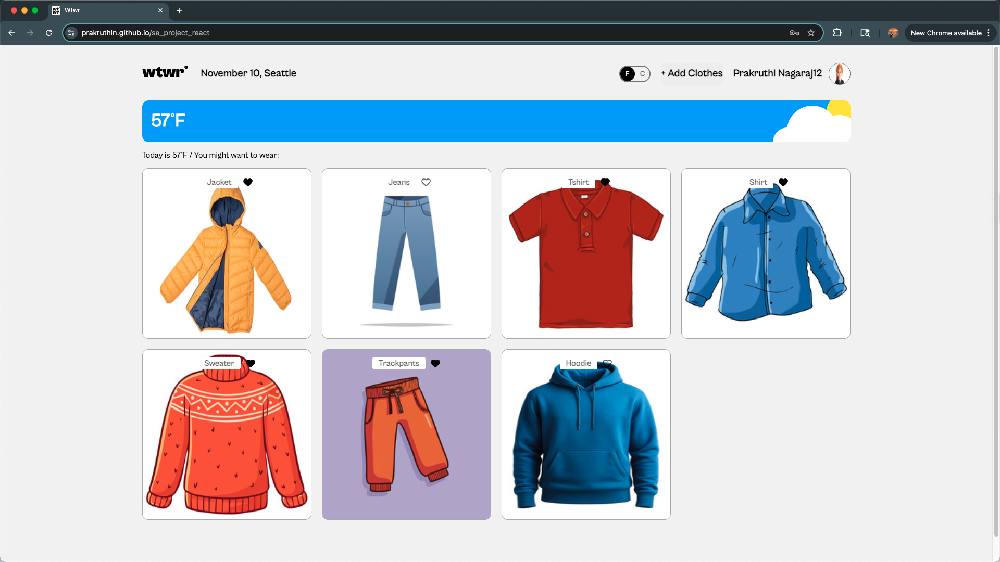
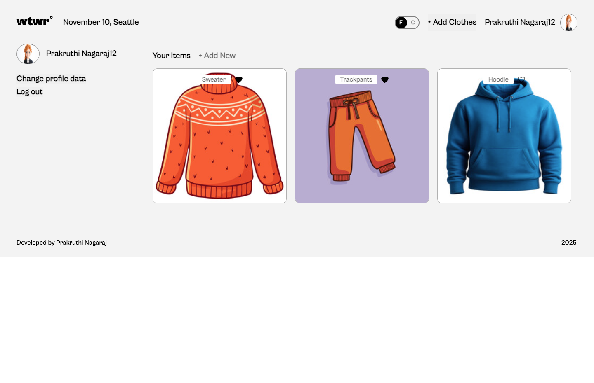
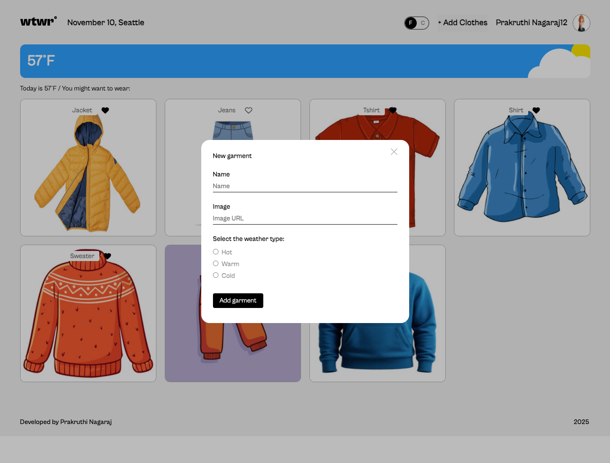
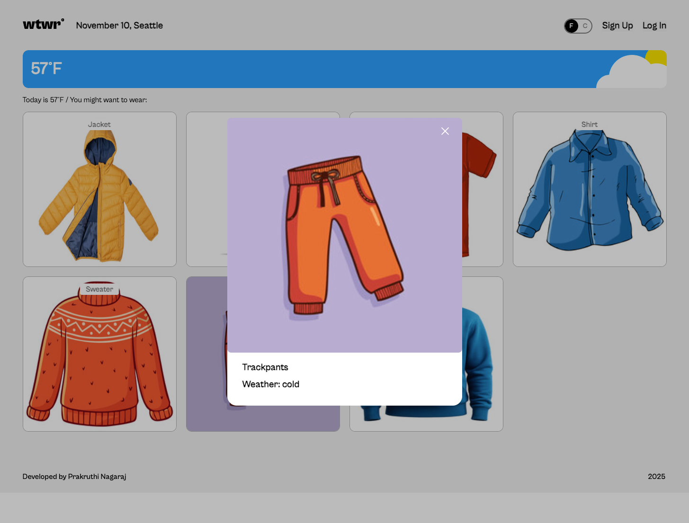
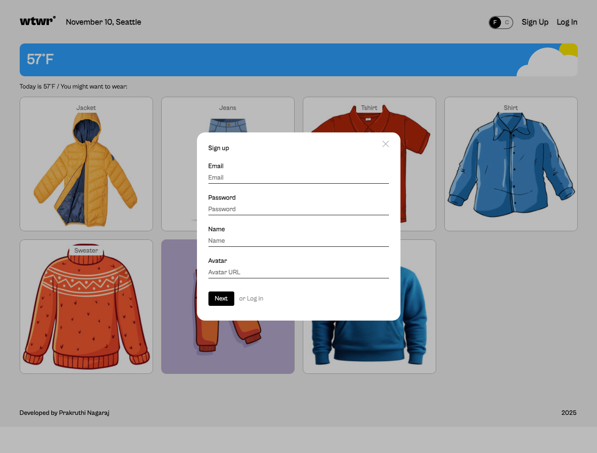

# WTWR (What To Wear?)

A React + Vite weather-based clothing recommendations app.

---

## 🌐 Live Demo

Check it out here:  
https://gcp-wtwr.jumpingcrab.com/

---

## 🧠 Backend Repository

The backend for this project is available here:  
👉 [WTWR Backend (Express API)](https://github.com/prakruthin/se_project_express)

---

## 📋 Overview

WTWR fetches current weather data and suggests clothing items accordingly. You can browse, add, and manage your wardrobe items—all tailored to the forecast!

---

## 🛠️ Built With

- **React** (functional components, hooks, context API)
- **Vite** for fast builds and HMR
- **React Router** for routing (home, profile, etc.)
- **Fetch / Axios** to interact with a weather & wardrobe API
- **CSS** (BEM, flex/grid, media queries)
- Optionally: authentication with token-based access

---

## 🔍 Features

- Shows weather via external API
- Filters and displays clothing suggestions
- Add new items with image, description, and weather tag
- Delete existing items
- Toggle temperature units (°C / °F)
- User auth (sign‑up, login/logout, protected profile routes)

---

## 📸 Screenshots

### Home Page

### Profile Page

### Add Garment Modal

### Item Modal

### Signup Modal

